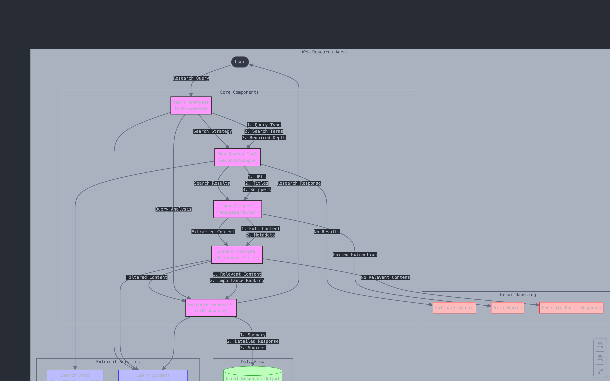

# Web Research Agent

A powerful AI-powered web research assistant that can search the web, extract data from websites, analyze content, and synthesize information to answer research queries.

## Features

- 🔍 **Intelligent Query Analysis** - Understands research intent and breaks down complex questions
- 🌐 **Web Search** - Generates optimal search terms and filters results by relevance
- 📄 **Content Extraction** - Scrapes relevant information from various website structures
- 🧩 **Information Synthesis** - Combines data from multiple sources and resolves contradictions
- 📝 **Comprehensive Reports** - Generates organized research reports that directly answer queries

## Architecture

The Web Research Agent uses a modular architecture with the following components:

1. **Query Analyzer** - Processes user queries to understand intent and extract key search terms
2. **Web Search Tool** - Searches the web using optimized search queries
3. **Web Scraper** - Extracts relevant content from webpages
4. **Content Analyzer** - Evaluates and filters information for relevance and reliability
5. **Response Generator** - Synthesizes information into coherent research reports



## Tools Integration

The agent integrates with the following tools:

- **Search API** (SerpAPI/Google Custom Search) - For web search functionality
- **Web Scraper** (BeautifulSoup/Newspaper3k) - For content extraction
- **Content Analyzer** (AI-powered) - For information relevance assessment

## Getting Started

### Prerequisites

- Python 3.9+
- API keys for OpenAI/Anthropic/Google
- SerpAPI key (or alternative search API)

### Installation

1. Clone the repository:
   ```bash
   git clone https://github.com/yourusername/web-research-agent.git
   cd web-research-agent
   ```

2. Create a virtual environment:
   ```bash
   python -m venv venv
   source venv/bin/activate  # On Windows: venv\Scripts\activate
   ```

3. Install dependencies:
   ```bash
   pip install -r requirements.txt
   ```

4. Set up environment variables:
   ```bash
   cp .env.example .env
   # Edit .env with your API keys
   ```

### Running the Agent

Start the web interface:

```bash
python app.py
```

Then open your browser and navigate to `http://localhost:5000`

### Running Tests

Run the test suite:

```bash
pytest
```

For coverage report:

```bash
pytest --cov=src
```

## Usage Examples

### Basic Query

```
What are the latest developments in quantum computing?
```

### Specific Research

```
Compare the environmental impact of electric vehicles vs. gasoline vehicles, using data from the last 2 years.
```

### Multi-part Research

```
Research the history of artificial intelligence, focusing on major breakthroughs in the last decade, and explain how they've impacted everyday technology.
```

## Error Handling

The agent handles various error scenarios gracefully:

- Website access issues
- API rate limits
- Conflicting information
- Irrelevant search results

## Project Structure

```
web-research-agent/
├── .env                    # Environment variables (API keys)
├── .gitignore              # Git ignore file
├── README.md               # Project documentation
├── requirements.txt        # Python dependencies
├── main.py                 # Main application entry point
├── app.py                  # Web application for the demo
├── tests/                  # Test files
├── src/                    # Source code
│   ├── agent/              # Agent implementation
│   ├── tools/              # External tools integration
│   └── utils/              # Utility functions
└── docs/                   # Additional documentation
```

## License

This project is licensed under the MIT License - see the LICENSE file for details.

## Acknowledgments

- OpenAI/Anthropic/Google for providing the AI models
- SerpAPI for search capabilities
- The open-source community for the various libraries used